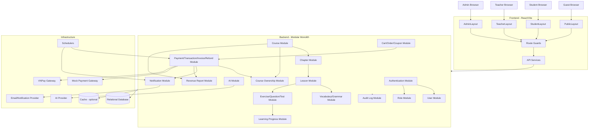
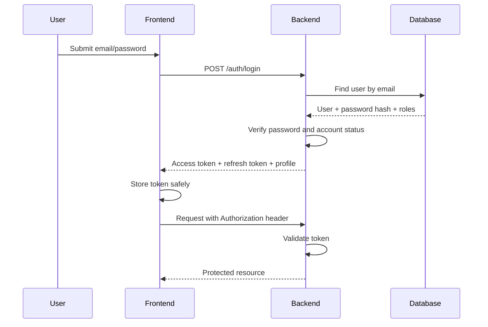
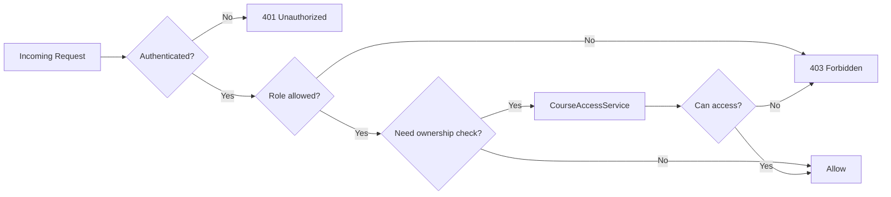
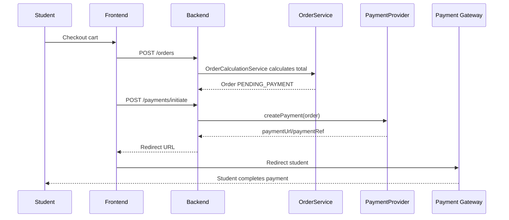
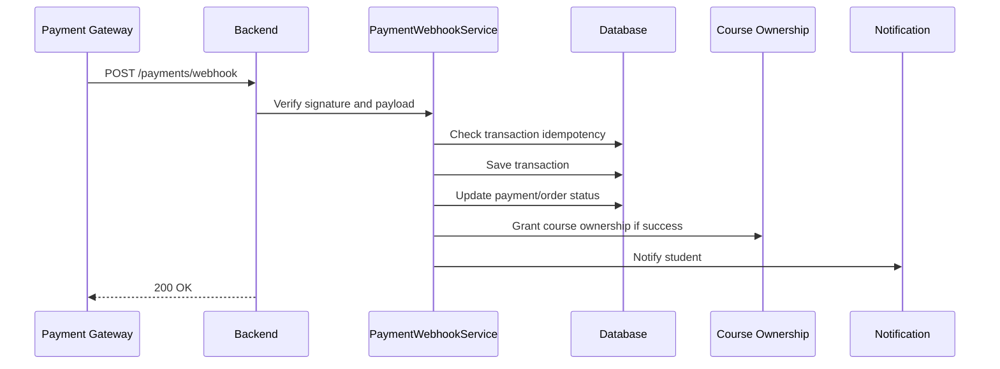
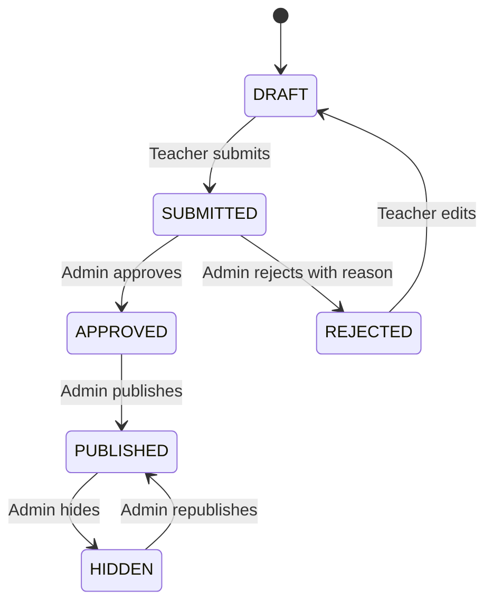
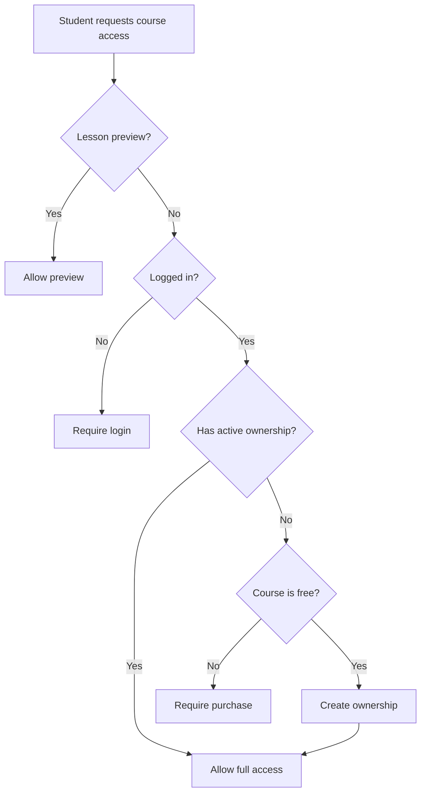

# Prompt 2 - Thiet ke kien truc he thong

Du an: `He thong ho tro hoc tieng Anh thong minh`

Muc tieu tai lieu: thiet ke kien truc tong the frontend, backend, flow va quy uoc he thong. Tai lieu nay chi mo ta kien truc, khong viet code nghiep vu.

## 1. Kien truc tong the bang Mermaid



## 2. Cau truc thu muc frontend

```text
frontend/
  src/
    assets/
      images/
      icons/
      fonts/
    components/
      common/
      course/
      lesson/
      payment/
      progress/
      ai/
      notification/
    constants/
      routes.js
      roles.js
      payment.js
      course-status.js
    context/
      AuthContext.jsx
      NotificationContext.jsx
    guards/
      AuthGuard.jsx
      RoleGuard.jsx
      GuestGuard.jsx
      CourseAccessGuard.jsx
    hooks/
      useAuth.js
      usePagination.js
      useDebounce.js
      useCourseAccess.js
    layouts/
      GuestLayout.jsx
      StudentLayout.jsx
      TeacherLayout.jsx
      AdminLayout.jsx
    pages/
      guest/
      student/
      teacher/
      admin/
    routes/
      AppRoutes.jsx
      guest.routes.jsx
      student.routes.jsx
      teacher.routes.jsx
      admin.routes.jsx
    services/
      apiClient.js
      authService.js
      userService.js
      courseService.js
      cartService.js
      orderService.js
      paymentService.js
      progressService.js
      aiService.js
      notificationService.js
    store/
      authStore.js
      cartStore.js
    styles/
      global.css
    utils/
      formatCurrency.js
      formatDate.js
      errorMessage.js
```

Ghi chu: project hien tai da co `pages`, `layouts`, `routes`, `components/common`, `config`, `styles`. Khi phat trien tiep, bo sung dan cac thu muc `services`, `guards`, `hooks`, `context`, `utils`, `constants` theo nhu cau.

## 3. Cau truc thu muc backend

```text
backend/
  src/main/java/com/example/englishlearning/
    EnglishLearningApplication.java
    controller/
      AuthController.java
      UserController.java
      CourseController.java
      LessonController.java
      CartController.java
      OrderController.java
      PaymentController.java
      AdminCourseController.java
    service/
      AuthService.java
      UserService.java
      CourseService.java
      OrderCalculationService.java
      CourseAccessService.java
      CouponValidationService.java
      PaymentWebhookService.java
      RefundService.java
      RevenueService.java
      impl/
        AuthServiceImpl.java
        CourseServiceImpl.java
        PaymentWebhookServiceImpl.java
    repository/
      UserRepository.java
      RoleRepository.java
      CourseRepository.java
      OrderRepository.java
      PaymentRepository.java
      TransactionRepository.java
    entity/
      User.java
      Role.java
      Course.java
      Chapter.java
      Lesson.java
      Vocabulary.java
      Grammar.java
      Exercise.java
      Question.java
      Test.java
      LearningProgress.java
      Cart.java
      Order.java
      Payment.java
      Transaction.java
      Coupon.java
      CourseOwnership.java
      Invoice.java
      Refund.java
      AuditLog.java
    dto/
      auth/
      user/
      course/
      payment/
      common/
    mapper/
      UserMapper.java
      CourseMapper.java
      OrderMapper.java
    payment/
      PaymentProvider.java
      MockPaymentProvider.java
      VnPayPaymentProvider.java
    security/
    config/
    exception/
    validator/
    util/
    event/
    listener/
    scheduler/
  src/main/resources/
    application.yml
    application-dev.yml
    application-prod.yml
```

Huong thiet ke backend dung cho project nay la `layer-first`:

- `controller`: nhan request, validate input co ban, tra response.
- `service`: dinh nghia use case.
- `service.impl`: hien thuc use case.
- `repository`: truy van database.
- `entity`: mo hinh du lieu persistence.
- `dto`: request/response object.
- `mapper`: chuyen doi entity va dto.
- `payment`: cac adapter cong thanh toan.

Ten file se the hien chuc nang, vi du `CourseController`, `CourseService`, `CourseRepository`, `CourseDto`. Cach nay phu hop voi team nho va de quan sat hon so voi viec tao package rieng cho tung module.

## 4. Cau truc du an tong

```text
project-root/
  backend/
  frontend/
  docs/
    analysis/
    architecture/
    flows/
    ui-map/
  database/
    migrations/
    seed/
  deployment/
    docker/
    nginx/
  .env.example
  README.md
```

## 5. Trach nhiem tung module

| Module | Trach nhiem |
|---|---|
| Authentication | Dang ky, dang nhap, refresh token, logout, quen mat khau. |
| User | Quan ly ho so nguoi dung, trang thai tai khoan. |
| Role | Quan ly vai tro va quyen truy cap. |
| Course | Quan ly khoa hoc, thong tin, trang thai, gia, phe duyet. |
| Chapter | Quan ly chuong thuoc khoa hoc. |
| Lesson | Quan ly bai hoc, noi dung hoc, bai preview. |
| Vocabulary | Noi dung tu vung theo bai hoc/khoa hoc. |
| Grammar | Noi dung ngu phap theo bai hoc/khoa hoc. |
| Exercise | Bai tap luyen tap. |
| Question | Ngan hang cau hoi, dap an, giai thich. |
| Test | Bai kiem tra, cau truc de, diem so. |
| Learning Progress | Tien do hoc, diem, lich su lam bai. |
| AI | Chatbot, goi y hoc, sua bai viet, quota va log. |
| Notification | Gui thong bao trong app/email. |
| Cart | Gio hang, them/xoa khoa hoc, kiem tra trung. |
| Order | Tao don hang, tinh tong tien, ap coupon. |
| Payment | Khoi tao thanh toan, xu ly ket qua thanh toan. |
| Transaction | Luu lich su giao dich tu gateway. |
| Coupon | Ma giam gia, dieu kien ap dung, han su dung. |
| Course Ownership | Quyen so huu khoa hoc/enrollment. |
| Invoice | Hoa don sau khi thanh toan thanh cong. |
| Refund | Yeu cau va xu ly hoan tien. |
| Revenue Report | Bao cao doanh thu admin/teacher. |
| Audit Log | Luu vet hanh dong quan trong va su kien rui ro. |

## 6. Chuan API response

```json
{
  "success": true,
  "message": "Request processed successfully",
  "data": {},
  "timestamp": "2026-07-11T10:00:00Z",
  "traceId": "req_abc123"
}
```

Quy uoc:

- `success`: `true` khi request thanh cong.
- `message`: thong diep ngan cho UI.
- `data`: du lieu nghiep vu.
- `timestamp`: thoi diem backend tra response.
- `traceId`: ma truy vet log.

## 7. Chuan error response

```json
{
  "success": false,
  "message": "Validation failed",
  "error": {
    "code": "VALIDATION_ERROR",
    "details": [
      {
        "field": "email",
        "message": "Email is invalid"
      }
    ]
  },
  "timestamp": "2026-07-11T10:00:00Z",
  "traceId": "req_abc123"
}
```

Nhom ma loi de xuat:

- `AUTH_INVALID_CREDENTIALS`
- `AUTH_TOKEN_EXPIRED`
- `FORBIDDEN`
- `RESOURCE_NOT_FOUND`
- `VALIDATION_ERROR`
- `COURSE_NOT_APPROVED`
- `COURSE_ALREADY_OWNED`
- `COUPON_INVALID`
- `PAYMENT_FAILED`
- `WEBHOOK_INVALID_SIGNATURE`
- `INTERNAL_ERROR`

## 8. Chuan pagination response

```json
{
  "success": true,
  "message": "Fetched successfully",
  "data": {
    "items": [],
    "page": 1,
    "size": 10,
    "totalItems": 125,
    "totalPages": 13,
    "hasNext": true,
    "hasPrevious": false
  },
  "timestamp": "2026-07-11T10:00:00Z",
  "traceId": "req_abc123"
}
```

Quy uoc:

- `page` bat dau tu `1` o API public de UI de dung.
- Backend co the convert ve zero-based neu framework yeu cau.
- Tat ca list lon nhu course, order, transaction, user, report deu dung pagination.

## 9. Authentication flow



Nguyen tac:

- Password luu dang hash.
- Access token ngan han.
- Refresh token dai hon va co co che revoke.
- Logout can revoke refresh token.
- UI chi mo route theo user profile/role nhan tu backend.

## 10. Authorization flow



Quy uoc:

- `Admin`: quan ly toan he thong.
- `Teacher`: quan ly khoa hoc do minh tao.
- `Student`: hoc, mua khoa, xem tien do cua minh.
- `Guest`: chi xem public va bai preview.
- Cac API quan trong can check ca role va ownership/resource ownership.

## 11. Payment flow



Thanh phan thanh toan:

- `PaymentProvider`: interface chung cho cong thanh toan.
- `MockPaymentProvider`: dung cho dev/test/demo.
- `VnPayPaymentProvider`: tich hop VNPay.
- `OrderCalculationService`: tinh gia, coupon, tong tien.
- `CouponValidationService`: kiem tra coupon truoc khi tao order.

## 12. Webhook flow



Nguyen tac:

- Webhook phai xac minh chu ky.
- Xu ly idempotent bang `gatewayTransactionId`.
- Khong cap quyen hoc neu payment chua thanh cong hoac chua xac minh.
- Loi noi bo nen retry duoc, khong tao trung ownership.

## 13. Course approval flow



Quy uoc:

- Teacher duoc sua khoa hoc o `DRAFT` hoac `REJECTED`.
- Khoa hoc `SUBMITTED` khong nen cho sua truc tiep.
- Khoa hoc chi hien public khi `PUBLISHED`.
- Admin duyet ca noi dung va gia.
- Ly do reject phai luu de Teacher sua.

## 14. Course ownership flow



Nguyen tac:

- Quyen hoc chi nen di qua `CourseAccessService`.
- Moi student chi co mot ownership/enrollment active cho mot khoa hoc.
- Refund co the thu hoi ownership theo chinh sach.
- Teacher/Admin khong can ownership nhung can role/resource permission.

## 15. Bien moi truong

Backend:

```env
APP_ENV=dev
APP_PORT=8080
APP_BASE_URL=http://localhost:8080
FRONTEND_BASE_URL=http://localhost:5173

DB_HOST=localhost
DB_PORT=3306
DB_NAME=english_learning
DB_USERNAME=root
DB_PASSWORD=

JWT_ACCESS_SECRET=change_me
JWT_REFRESH_SECRET=change_me
JWT_ACCESS_TTL_MINUTES=30
JWT_REFRESH_TTL_DAYS=14

PAYMENT_PROVIDER=mock
VNPAY_TMN_CODE=
VNPAY_HASH_SECRET=
VNPAY_PAY_URL=
VNPAY_RETURN_URL=
VNPAY_WEBHOOK_SECRET=

AI_PROVIDER=
AI_API_KEY=
AI_TIMEOUT_SECONDS=30

MAIL_HOST=
MAIL_PORT=
MAIL_USERNAME=
MAIL_PASSWORD=
```

Frontend:

```env
VITE_API_BASE_URL=http://localhost:8080/api
VITE_APP_NAME=English Learning
VITE_PAYMENT_RETURN_URL=http://localhost:5173/student/checkout/result
```

Bao mat:

- Khong commit file `.env` that.
- Commit `.env.example`.
- Moi moi truong `dev`, `test`, `prod` co secret rieng.

## 16. Thiet ke Git branch

Nhanh chinh:

- `main`: code on dinh, co the release.
- `develop`: tich hop tinh nang truoc khi release.

Nhanh lam viec:

- `feature/auth`
- `feature/course`
- `feature/payment`
- `feature/frontend-student`
- `feature/frontend-teacher`
- `feature/admin-management`
- `bugfix/<short-name>`
- `hotfix/<short-name>`

Quy uoc:

- Tao branch tu `develop` cho feature.
- Pull request ve `develop`.
- Release merge tu `develop` vao `main`.
- Commit message nen theo dang `type(scope): summary`, vi du `feat(auth): add login api`.

## 17. De xuat thu tu trien khai

1. Khoi tao backend, frontend, database migration va cau hinh moi truong.
2. Authentication, User, Role, Security, API response/error response.
3. Public course catalog: Course, Chapter, Lesson preview.
4. Teacher authoring: tao/sua course, chapter, lesson, vocabulary, grammar, question.
5. Course approval va publishing cho Admin.
6. Course ownership va CourseAccessService.
7. Student learning: lesson access, exercise, test, learning progress.
8. Cart, Coupon, OrderCalculationService, Order.
9. PaymentProvider, MockPaymentProvider, VnPayPaymentProvider.
10. PaymentWebhookService, Transaction, Invoice, cap ownership sau thanh toan.
11. RefundService va xu ly thu hoi quyen hoc neu can.
12. AI chatbot va writing correction.
13. Notification, Audit Log, scheduler cleanup order/payment pending.
14. RevenueService va revenue report cho Admin/Teacher.
15. Hardening: validation, rate limit, logging, monitoring, test, seed data.
