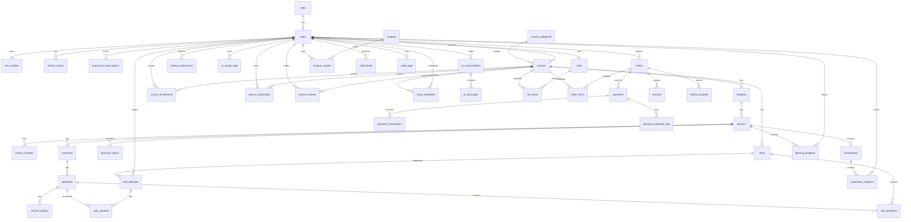

# Prompt 3 - Thiet ke database MySQL

Du an: `He thong ho tro hoc tieng Anh thong minh`

Muc tieu: thiet ke database chuan hoa den 3NF, co khoa chinh, khoa ngoai, unique constraint, index, enum, ERD, SQL tao database, seed data va drop table.

## 1. Nguyen tac thiet ke

- Database dung MySQL 8, charset `utf8mb4`.
- Primary key dung `BIGINT UNSIGNED AUTO_INCREMENT`.
- Tien dung `DECIMAL(12,2)`, khong dung `FLOAT/DOUBLE`.
- Bang nghiep vu quan trong co `created_at`, `updated_at`, `deleted_at` neu can soft delete.
- Order, payment, transaction khong xoa vat ly; chi cap nhat status.
- `transaction_code` unique.
- `webhook_code` unique de chong xu ly trung webhook.
- Mot Student chi so huu mot khoa hoc mot lan: unique `(user_id, course_id)` trong `course_ownerships`.
- Mot khoa hoc chi xuat hien mot lan trong gio: unique `(cart_id, course_id)` trong `cart_items`.
- `order_items` luu snapshot ten khoa hoc, gia goc, gia ban, gia cuoi tai thoi diem mua.
- User dang ky mac dinh la role `STUDENT`.
- Teacher do Admin tao hoac cap quyen bang cach doi `role_id`.

## 2. Nhom bang nguoi dung

### roles

Luu vai tro he thong.

| Cot | Kieu | Rang buoc |
|---|---|---|
| id | BIGINT UNSIGNED | PK |
| code | VARCHAR(50) | UNIQUE, NOT NULL |
| name | VARCHAR(100) | NOT NULL |
| description | VARCHAR(255) | NULL |
| created_at | DATETIME | NOT NULL |
| updated_at | DATETIME | NOT NULL |

Index: unique `uk_roles_code`.

### users

Luu thong tin dang nhap va role chinh cua user.

| Cot | Kieu | Rang buoc |
|---|---|---|
| id | BIGINT UNSIGNED | PK |
| role_id | BIGINT UNSIGNED | FK roles.id |
| email | VARCHAR(255) | UNIQUE, NOT NULL |
| password_hash | VARCHAR(255) | NOT NULL |
| full_name | VARCHAR(150) | NOT NULL |
| phone | VARCHAR(30) | NULL |
| avatar_url | VARCHAR(500) | NULL |
| status | ENUM | ACTIVE, INACTIVE, LOCKED |
| email_verified_at | DATETIME | NULL |
| last_login_at | DATETIME | NULL |
| created_at | DATETIME | NOT NULL |
| updated_at | DATETIME | NOT NULL |
| deleted_at | DATETIME | NULL |

Index: `idx_users_role_id`, `idx_users_status`, unique `uk_users_email`.

### user_profiles

Luu thong tin mo rong cua user.

| Cot | Kieu | Rang buoc |
|---|---|---|
| id | BIGINT UNSIGNED | PK |
| user_id | BIGINT UNSIGNED | UNIQUE, FK users.id |
| date_of_birth | DATE | NULL |
| gender | ENUM | MALE, FEMALE, OTHER |
| english_level | ENUM | BEGINNER, ELEMENTARY, INTERMEDIATE, ADVANCED |
| learning_goal | VARCHAR(255) | NULL |
| bio | TEXT | NULL |
| created_at | DATETIME | NOT NULL |
| updated_at | DATETIME | NOT NULL |

### refresh_tokens

Luu refresh token dang hoat dong va revoke.

| Cot | Kieu | Rang buoc |
|---|---|---|
| id | BIGINT UNSIGNED | PK |
| user_id | BIGINT UNSIGNED | FK users.id |
| token_hash | VARCHAR(255) | UNIQUE, NOT NULL |
| expires_at | DATETIME | NOT NULL |
| revoked_at | DATETIME | NULL |
| created_at | DATETIME | NOT NULL |

Index: `idx_refresh_tokens_user_id`, `idx_refresh_tokens_expires_at`.

### password_reset_tokens

Luu token reset mat khau cho chuc nang quen mat khau. Bang nay duoc bo sung khi trien khai Prompt 5.

| Cot | Kieu | Rang buoc |
|---|---|---|
| id | BIGINT UNSIGNED | PK |
| user_id | BIGINT UNSIGNED | FK users.id |
| token_hash | VARCHAR(255) | UNIQUE, NOT NULL |
| expires_at | DATETIME | NOT NULL |
| used_at | DATETIME | NULL |
| created_at | DATETIME | NOT NULL |

Index: `idx_password_reset_tokens_user_id`, `idx_password_reset_tokens_expires_at`.

## 3. Nhom bang khoa hoc

### course_categories

Danh muc khoa hoc.

| Cot | Kieu | Rang buoc |
|---|---|---|
| id | BIGINT UNSIGNED | PK |
| name | VARCHAR(120) | NOT NULL |
| slug | VARCHAR(150) | UNIQUE, NOT NULL |
| description | VARCHAR(255) | NULL |
| status | ENUM | ACTIVE, INACTIVE |
| created_at | DATETIME | NOT NULL |
| updated_at | DATETIME | NOT NULL |
| deleted_at | DATETIME | NULL |

### courses

Bang trung tam cua catalog khoa hoc.

| Cot | Kieu | Rang buoc |
|---|---|---|
| id | BIGINT UNSIGNED | PK |
| category_id | BIGINT UNSIGNED | FK course_categories.id |
| teacher_id | BIGINT UNSIGNED | FK users.id |
| title | VARCHAR(200) | NOT NULL |
| slug | VARCHAR(220) | UNIQUE, NOT NULL |
| short_description | VARCHAR(500) | NULL |
| description | TEXT | NULL |
| thumbnail_url | VARCHAR(500) | NULL |
| level | ENUM | BEGINNER, ELEMENTARY, INTERMEDIATE, ADVANCED |
| course_type | ENUM | FREE, PAID |
| original_price | DECIMAL(12,2) | NOT NULL |
| sale_price | DECIMAL(12,2) | NULL |
| sale_start_at | DATETIME | NULL |
| sale_end_at | DATETIME | NULL |
| status | ENUM | DRAFT, SUBMITTED, APPROVED, REJECTED, PUBLISHED, HIDDEN |
| published_at | DATETIME | NULL |
| created_at | DATETIME | NOT NULL |
| updated_at | DATETIME | NOT NULL |
| deleted_at | DATETIME | NULL |

Index: `idx_courses_teacher_id`, `idx_courses_category_id`, `idx_courses_status`, `idx_courses_level`, `idx_courses_course_type`.

### chapters

Chuong thuoc khoa hoc.

| Cot | Kieu | Rang buoc |
|---|---|---|
| id | BIGINT UNSIGNED | PK |
| course_id | BIGINT UNSIGNED | FK courses.id |
| title | VARCHAR(200) | NOT NULL |
| description | VARCHAR(500) | NULL |
| position | INT | NOT NULL |
| status | ENUM | DRAFT, PUBLISHED, HIDDEN |
| created_at | DATETIME | NOT NULL |
| updated_at | DATETIME | NOT NULL |
| deleted_at | DATETIME | NULL |

Unique: `(course_id, position)`.

### lessons

Bai hoc thuoc chuong.

| Cot | Kieu | Rang buoc |
|---|---|---|
| id | BIGINT UNSIGNED | PK |
| chapter_id | BIGINT UNSIGNED | FK chapters.id |
| title | VARCHAR(200) | NOT NULL |
| lesson_type | ENUM | VIDEO, AUDIO, TEXT, MIXED |
| content | LONGTEXT | NULL |
| audio_url | VARCHAR(500) | NULL |
| video_url | VARCHAR(500) | NULL |
| position | INT | NOT NULL |
| duration_minutes | INT | DEFAULT 0 |
| is_preview | BOOLEAN | DEFAULT FALSE |
| status | ENUM | DRAFT, PUBLISHED, HIDDEN |
| created_at | DATETIME | NOT NULL |
| updated_at | DATETIME | NOT NULL |
| deleted_at | DATETIME | NULL |

Unique: `(chapter_id, position)`. Index: `idx_lessons_is_preview`.

### lesson_contents

Noi dung phu de chia nho bai hoc.

| Cot | Kieu | Rang buoc |
|---|---|---|
| id | BIGINT UNSIGNED | PK |
| lesson_id | BIGINT UNSIGNED | FK lessons.id |
| content_type | ENUM | TEXT, IMAGE, AUDIO, VIDEO, FILE |
| title | VARCHAR(200) | NULL |
| body | LONGTEXT | NULL |
| resource_url | VARCHAR(500) | NULL |
| position | INT | NOT NULL |
| created_at | DATETIME | NOT NULL |
| updated_at | DATETIME | NOT NULL |

### course_enrollments

Luu trang thai ghi danh/hoc cua student.

| Cot | Kieu | Rang buoc |
|---|---|---|
| id | BIGINT UNSIGNED | PK |
| user_id | BIGINT UNSIGNED | FK users.id |
| course_id | BIGINT UNSIGNED | FK courses.id |
| enrolled_at | DATETIME | NOT NULL |
| completed_at | DATETIME | NULL |
| status | ENUM | ACTIVE, COMPLETED, CANCELED |
| created_at | DATETIME | NOT NULL |
| updated_at | DATETIME | NOT NULL |

Unique: `(user_id, course_id)`.

### course_ownerships

Luu quyen so huu khoa hoc, sinh ra tu free enrollment hoac order thanh cong.

| Cot | Kieu | Rang buoc |
|---|---|---|
| id | BIGINT UNSIGNED | PK |
| user_id | BIGINT UNSIGNED | FK users.id |
| course_id | BIGINT UNSIGNED | FK courses.id |
| order_item_id | BIGINT UNSIGNED | FK order_items.id, NULL |
| ownership_type | ENUM | FREE, PURCHASED, ADMIN_GRANTED |
| status | ENUM | ACTIVE, REVOKED |
| granted_at | DATETIME | NOT NULL |
| revoked_at | DATETIME | NULL |
| created_at | DATETIME | NOT NULL |
| updated_at | DATETIME | NOT NULL |

Unique: `(user_id, course_id)`.

### course_reviews

Danh gia khoa hoc.

| Cot | Kieu | Rang buoc |
|---|---|---|
| id | BIGINT UNSIGNED | PK |
| user_id | BIGINT UNSIGNED | FK users.id |
| course_id | BIGINT UNSIGNED | FK courses.id |
| rating | TINYINT | 1..5 |
| comment | TEXT | NULL |
| status | ENUM | VISIBLE, HIDDEN |
| created_at | DATETIME | NOT NULL |
| updated_at | DATETIME | NOT NULL |
| deleted_at | DATETIME | NULL |

Unique: `(user_id, course_id)`.

## 4. Nhom bang hoc tap

Bang hoc tap gom:

| Bang | Mo ta ngan |
|---|---|
| vocabularies | Tu vung theo lesson/course. |
| grammar_topics | Chu de ngu phap theo lesson/course. |
| exercises | Bai luyen tap theo lesson. |
| questions | Cau hoi cho exercise/test. |
| answer_options | Lua chon dap an cua cau hoi. |
| tests | Bai kiem tra trong course. |
| test_questions | Bang noi test va question. |
| test_attempts | Lan lam bai test cua user. |
| user_answers | Cau tra loi cua user. |
| learning_progress | Tien do bai hoc. |
| vocabulary_progress | Tien do hoc tu vung. |
| study_schedules | Lich hoc ca nhan. |

## 5. Nhom bang AI

| Bang | Mo ta ngan |
|---|---|
| ai_conversations | Phien hoi thoai AI cua user. |
| ai_messages | Tin nhan trong phien hoi thoai. |
| writing_submissions | Bai viet user gui de AI sua. |
| ai_usage_logs | Log luot dung AI, token, chi phi uoc tinh. |

## 6. Nhom bang thuong mai

| Bang | Mo ta ngan |
|---|---|
| carts | Gio hang cua user. |
| cart_items | Khoa hoc trong gio, unique theo cart va course. |
| orders | Don hang, khong xoa vat ly. |
| order_items | Snapshot khoa hoc va gia tai thoi diem mua. |
| payments | Lan thanh toan cho order. |
| payment_transactions | Giao dich tu gateway, `transaction_code` unique. |
| payment_webhook_logs | Log webhook, `webhook_code` unique. |
| coupons | Ma giam gia. |
| coupon_usages | Lich su dung coupon. |
| invoices | Hoa don sau khi thanh toan thanh cong. |
| refund_requests | Yeu cau hoan tien. |

## 7. Nhom bang he thong

| Bang | Mo ta ngan |
|---|---|
| notifications | Thong bao user. |
| audit_logs | Luu vet hanh dong quan trong. |

## 8. Enum chinh

| Enum | Gia tri |
|---|---|
| user_status | ACTIVE, INACTIVE, LOCKED |
| gender | MALE, FEMALE, OTHER |
| english_level | BEGINNER, ELEMENTARY, INTERMEDIATE, ADVANCED |
| course_type | FREE, PAID |
| course_status | DRAFT, SUBMITTED, APPROVED, REJECTED, PUBLISHED, HIDDEN |
| lesson_type | VIDEO, AUDIO, TEXT, MIXED |
| lesson_status | DRAFT, PUBLISHED, HIDDEN |
| question_type | SINGLE_CHOICE, MULTIPLE_CHOICE, TRUE_FALSE, FILL_BLANK, WRITING |
| order_status | PENDING_PAYMENT, PAID, CANCELED, REFUNDED, PARTIALLY_REFUNDED |
| payment_status | INITIATED, SUCCESS, FAILED, CANCELED |
| refund_status | REQUESTED, APPROVED, REJECTED, REFUNDED |
| notification_type | SYSTEM, COURSE, PAYMENT, AI |

## 9. ERD bang Mermaid

## 10. File SQL

- Tao database va table: `database/migrations/001_create_schema.sql`.
- Du lieu mau: `database/seed/001_seed_sample_data.sql`.
- Drop table dung thu tu: `database/migrations/999_drop_all.sql`.

## 11. Cach import bang MySQL Workbench

1. Mo MySQL Workbench va ket noi vao MySQL local.
2. Chon `File > Open SQL Script`.
3. Mo `database/migrations/001_create_schema.sql`.
4. Bam nut Execute de tao database va cac bang.
5. Mo `database/seed/001_seed_sample_data.sql`.
6. Bam Execute de tao role, Admin, Teacher, Student, khoa FREE va PAID.
7. Neu can tao lai tu dau, chay `database/migrations/999_drop_all.sql`, sau do chay lai schema va seed.
